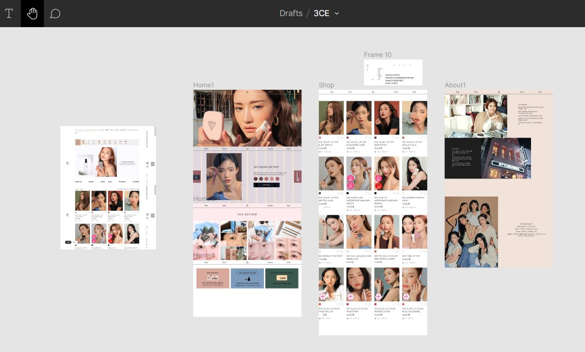

# 3CE React App

3CE 웹 사이트의 UI/UX 디자인을 재구성하여 REACT로 만들었습니다. [3CE APP Link](https://master.dcmjulx3cmwfq.amplifyapp.com/)

Figma로 미리 제가 만들고 싶은 3CE 앱을 구상해본 뒤 개발했습니다.




### Libraries
- ReactJS
- react router dom
- GlslCanvas

리액트는 컴포넌트를 재사용 가능하기 때문에 쇼핑앱처럼 반복적인 card UI를 자주 쓸 때 적합하며 유지보수가 용이하다.

### Project structure
```
└─ Github
      │  README.md
      │
      ├── public
      │    └── index.html
      │
      └── src
           ├── App.js
           ├── index.js
           ├── index.css
           ├── components
           │    ├── aboutBox
           │    ├── canvas
           │    ├── container
           │    ├── coupons
           │    ├── filter
           │    ├── footer
           │    ├── layout
           │    ├── modals
           │    ├── pageTitle
           │    ├── pagination
           │    └── post
           ├── fragments
           │    └── frag.js
           ├── hooks
           │    └── PaginationHook.js
           └── pages
                ├── Shop.js
                ├── About.js
                ├── Home.js
                ├── Review.js
                └── Video.js
```

### Pages
+ __Home__  &nbsp;&nbsp; 3CE 앱에 들어갔을 때 첫 페이지.
+ __Shop__  &nbsp;&nbsp;&nbsp;&nbsp;상품 목록을 볼 수 있는 페이지. 필터 버튼으로 상품 카테고리를 선택 가능.
+ __About__  &nbsp;&nbsp;&nbsp;3CE 브랜드 소개 페이지.
+ __Review__  &nbsp;상품 사용 후기 페이지.
+ __Video__&nbsp;&nbsp;&nbsp;&nbsp;&nbsp;비디오 페이지.

### Components
+ `aboutBox` : `About` 페이지의 섹션
+ `canvas` : Html5 Canvas 요소로, 2D 그래픽을 렌더링한다. `Home` 페이지에 있다. 클릭을 할 때마다 이미지가 바뀐다.
+ `container` : 페이지 내 컴포넌트들을 묶는 `div` 태그.
+ `coupons` : 쿠폰 섹션.
+ `filter` : `Shop` 페이지에서 상품을 카테고리별로 분류하는 버튼 태그들.
+ `footer` : `footer` 요소.
+ `layout` : 상단 `nav` 및 좌측 로그인, 회원가입 메뉴를 렌더링하는 컴포넌트. 상단 `nav`는 `react-router`를 썼다.
+ `pageTitle` : 각 페이지의 이름을 렌더링하는 컴포넌트.
+ `pagination` : 페이지 하단에 아이템 리스트의 페이지 버튼을 렌더링한다.
+ `post` : 아이템 리스트의 아이템 요소를 렌더링한다.

### Fragments
`canvas` 태그에 렌더링할 그래픽 프로그램을 코딩한 파일이 있는 디렉터리다. `openGL Shader Language (glsl)`를 썼다.

### Hooks
커스텀 hook을 저장한 디렉터리다. 중복되는 코드를 하나의 로직으로 묶어서 언제나 쉽게 import하기 위해 만들었다.

`Pagination` 컴포넌트의 경우, `Shop`, `Review` 그리고 `Video` 페이지에서 쓰인다. 이 컴포넌트를 쓰기 위해선 매번 현재 페이지 상태와 현재 보이는 항목 인덱스를 계산하는 긴 코드를 써야한다. 이를 간결히 줄이기 위해 `usePagination` hook으로 만들어서 페이지마다 호출했다.

### Database
구글의 웹 애플리케이션 개발 플랫폼인 __FireBase__ 로 앱의 아이템, 리뷰, 그리고 비디오 항목 데이터를 관리했다. FireBase의 Realtime Database라는 NoSQL 클라우드 데이터베이스에 데이터를 저장시켜 페이지가 로드될 때 실시간으로 `useEffect` hook에서 `fetch` API로 데이터를 가져왔다.
```js
useEffect(() => {
       fetch(
           'https://react-cosmetics-shop-bdae3-default-rtdb.firebaseio.com/shop.json'
       ).then((response) => {
           return response.json();
       }).then((data) => {
           setItems(data.map(item => ({...item, interest: false, display: true})));
           setDisplayNumber(data.length);
       });

   }, []);
```
